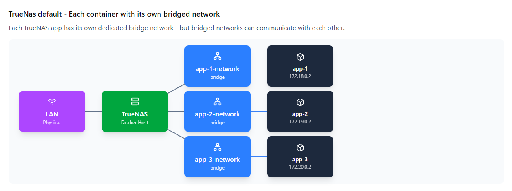
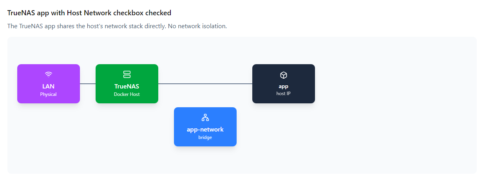
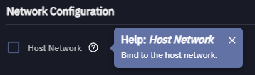
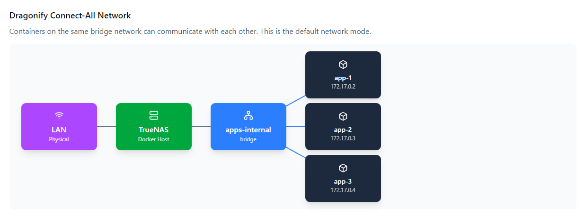
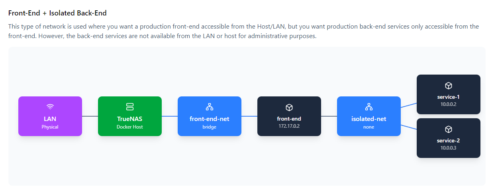
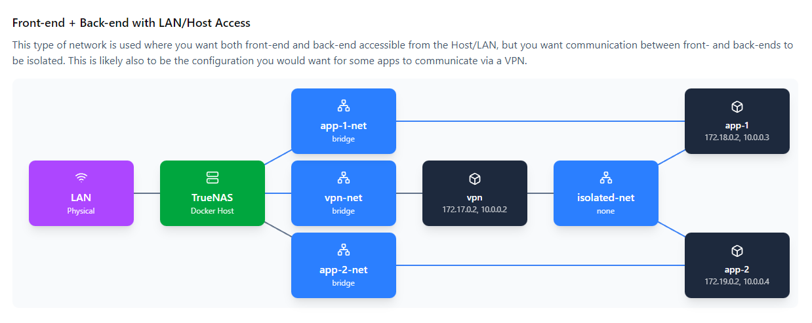
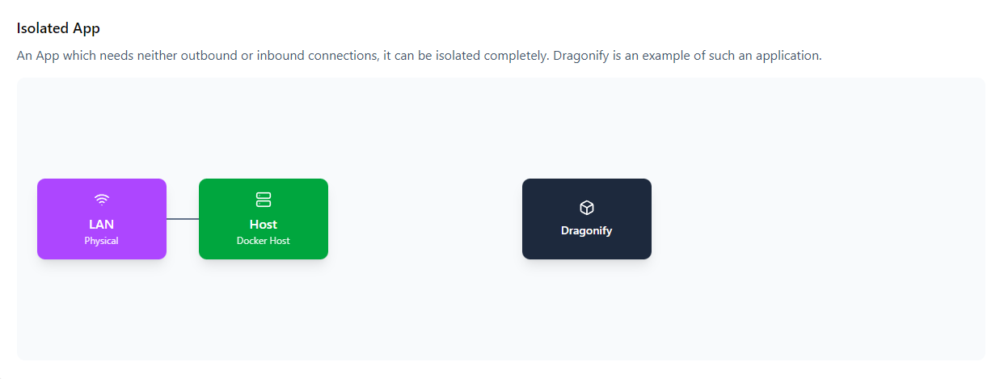

# Dragonify

***Dragonify*** is a small docker-container based utility app for TrueNAS Scale 24.10 (Electric Eel) onwards
which can reconfigure the default Docker networks provided by TrueNAS Scale for apps to allow them to communicate
with each other.

In its initial form in TrueNAS Scale Electric Eel, the application networking differs substantially from the previous Kubernetes networking architecture (where all apps shared a single container network). iX's initial Docker-apps implementation has only two options for Docker networks:

1. Default - every app is connected to its own app-specific Docker bridged network with its own private subnet (by default in the 172.*.*.* range)
2. Host Network - although the app has it's app-specific Docker network created, it is ***not*** connected to it and uses the Host IP address(es) instead.

In its initial form, TJ Horner created this utility to replicate the previous Kubernetes network-architecture,
creating a single shared Docker bridged network and connecting every non-Host-network app to it (CONNECT_ALL).
To assist further with this Kubernetes simulation, it provided backward-compatibility
with the old Kubernetes-based apps system for DNS names,
by adding a DNS-alias in the format `{service}.ix-{app-name}.svc.cluster.local` for each app.

A [subsequent improvement](https://github.com/tjhorner/dragonify/pull/3) by @casse-boubou
extended the original concept to allow the original CONNECT_ALL approach to be disabled,
and for individual containers to have a Docker Label defining a network for it to be connected to.
(This PR was never merged.)

A [further PR to the Casse-Boubou version](https://github.com/casse-boubou/dragonify/pull/1) by @EngTurtle
fixed a race condition whereby two containers starting at the same time,
and connecting to the same Dragonify network which needs to be created,
may both attempt to create this new network at the same time with one of these attempts failing
only because the other attempt succeeded.
This version also made some changes to improve security.

Finally, this current version by Sophist-UK is standing firmly on the shoulders of these three users,
consisting of a full rewrite in fully compliant TypeScript,
and allowing a number of alternative Docker-network architectures to be used
on a container-by-container basis.

## Technical Warnings

1. This Dragonify utility is a stop-gap until inter-app networking is fully implemented in TrueNAS Scale.
***See https://forums.truenas.com/t/inter-app-communication-in-24-10-electric-eel/22054 for a discussion about this.***

   ***WARNING:*** Dragonify introduces functionality that is unsupported by iXsystems. If you are having problems with your TrueNAS installation or its apps, please try stopping Dragonify and restarting all apps to see if the problem persists.

2. Dragonify achieves the target network reconfiguration by using the [Docker REST Api](https://docs.docker.com/reference/api/engine/version/v1.47),
to run the equivalent of `docker network connect` commands against already running containers.

   It does ***not*** update the TrueNAS application definitions to make the changes before the container starts.

   Because these commands change the container's network configuration at run-time ***after*** it has initialised,
the container needs to be able to recognise that it's configuration has changed and reconfigure the container
IP routing tables, and this depends on what base O/S the container has been built upon.

## Change Log

| Author | Version |Image | Description
|-|-|-|-
| TJ Horner | v0.1 | ghcr.io/tjhorner/dragonify:main | Connect all non-Host containers to a single shared bridged Docker network (CONNECT_ALL)
| Casse Boubou | v0.2 | ghcr.io/tjhorner/dragonify:main | Allow individual containers to define their own Docker bridged network - allows multiple shared bridged Docker networks (CONNECT_ALL=false)
| EngTurtle | v0.3 | ghcr.io/EngTurtle/dragonify:main | Handle errors resulting from 2 or more parallel requests to create a new network (for e.g. multiple containers starting simultaneously in e.g. NextCloud), switch from pnpm to npm to avoid needing network connection (potential security issue),
| Sophist-UK | v0.4alpha | ghcr.io/Sophist-UK/dragonify:main | As above plus refactored code, supports additional Docker network approaches, improved logging, more efficient container start/stop event handling, handle Dragonify terminate signal, track networks and connected containers to avoid unnecessary Docker calls, add github actions for linting and TypeScript code quality analysis

**Note:** This table will be updated as v0.4 progresses and when image locations above are change when PRs are merged.

## Docker Network approaches

This section is designed to give you a pictorial representation of the different ways you can use Dragonify
and details of how to set up Dragonify in each of the situations.

Whilst this is ***not*** a substitute for a detailed understanding of [Docker Networking](),
it is hoped that this will be sufficient for you to decide which approach to use and how to set things up.

### TrueNAS Docker Default Networks



This diagram shows how TrueNAS defines Docker Networks for each of its apps.

TrueNAS creates a separate bridged network for each app, and that bridged network has only that specific container
attached to it. If you specify ports to be opened, then these are opened on the Host IP address and port-forwarded to the bridged IP address.

It is possible for one container to request services for another,
however for that to work a port needs to be opened on the host for each of the services,
and this is considered a security risk (particularly in Enterprise and/or production environments)
because it means that a hacker can attempt to gain access through this open port.

For that reason, a lot of people want to continue to use some form of shared Docker network,
so that requests from one container to another can be made purely within a single Docker network
and without opening ports on the host that might be a security risk.

Hence, Dragonify was born as a means of bypassing the Docker Network restrictions
in the initial TrueNAS Docker Scale implementation.

**To-Do:** Update to confirm what happens if you have multiple containers with the same image?

### TrueNAS Docker Host Network

Before looking at what Dragonify can do, it is worth just documenting the only
alternative networking approach in TrueNAS Scale Electric Eel's Docker implementation,
"Host Networks".



When you create an App using the TrueNAS Scale UI, you generally have a checkbox that can be selected to use Host Network:



If you check this box, then the container does not use a bridged network, but instead is considered like a native app,
directing using the host IP address(es). If you open ports for this app, these ports go directly to the container.

However, despite not connecting to it, TrueNAS continues to create the aligned bridged Docker Network,
though this is not connected to.

Dragonify ignores containers that use Host Connected networks and does not attempt to change their connected Docker Networks.
(If you specify a Dragonify Docker Label on a Host Network, a log warning will be issued to notify you of this invalid combination,
but no network changes will be made regardless.)

### Dragonify CONNECT_ALL



This diagram shows how both earlier versions of TrueNAS that used Kubernetes
mapped apps (except Host Network apps)to Docker Networks,
and how the original Dragonify version mapped networks in later versions of TrueNAS that use Docker.

If you ***don't*** specify `CONNECT_ALL = "false"` as a Dragonify environment variable,
then (for backwards compatibility purposes) Dragonify will continue to
connect all containers to a single common Docker bridged network (`apps-internal`).

However this is a one-option approach, and @Casse-Boubou extended the functionality so that:
* if you specify an environment variable `CONNECT_ALL = "false"`, then
* for each container, you can define using a Docker Label (`tj.horner.dragonify.networks`)
the alternative network(s) you want Dragonify to connect the container to
* if you don't define such a label then Dragonify does nothing with the container,
leaving it on the default application-specific bridged network.

By configuring it this way, instead of a single `apps-internal` bridged network,
you can now have several shared bridged networks for different groups of applications.

### Dragonify Front-end + Isolated Back-end



### Dragonify Front-end + Accessible Back-end



### Dragonify Completely Isolated Container



## Installation

The following instructions assume that you are installing v0.4.
If you decide to install an earlier version,
then you will need to research how to vary the instructions below.

As yet, Dragonify has not made it to the TrueNAS Apps Store,
so you will need to install it as a Custom App in TrueNAS Scale,
and there are a couple of ways to do this after going to
the Apps page in the TrueNAS UI and clicking `Discover Apps`:

### Custom App screens...


### Custom Compose.yaml...

1. Click **⋮** in the top-right corner, then "Install via YAML".

2. Set the app-name to `dragonify`, and paste the following YAML into the text box.

```yaml
services:
  dragonify:
    image: ###choose image according to the version table above###
    restart: always
    environment:
      LOG_LEVEL: info # change to debug for more verbose logging
      CONNECT_ALL
    volumes:
      - /var/run/docker.sock:/var/run/docker.sock
```

Once started, all of your apps will now be connected on the same Docker network with DNS aliases for each service.

## Technical Details

To facilitate inter-app communication, Dragonify creates a new Docker bridge network called `apps-internal`. It connects all existing TrueNAS-managed containers to the network, then starts listening for new containers to be started. When a new container is started, Dragonify will automatically connect it to the `apps-internal` network.

It is essentially running this command automatically for you (using postgres as an example):

```sh
docker network connect apps-internal --alias postgres.ix-postgres.svc.cluster.local ix-postgres-postgres-1
```

## License

MIT